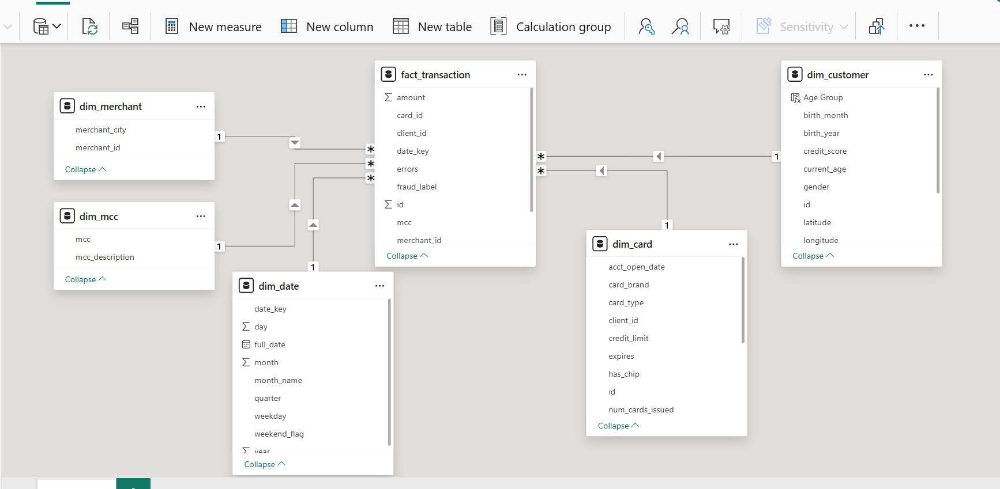
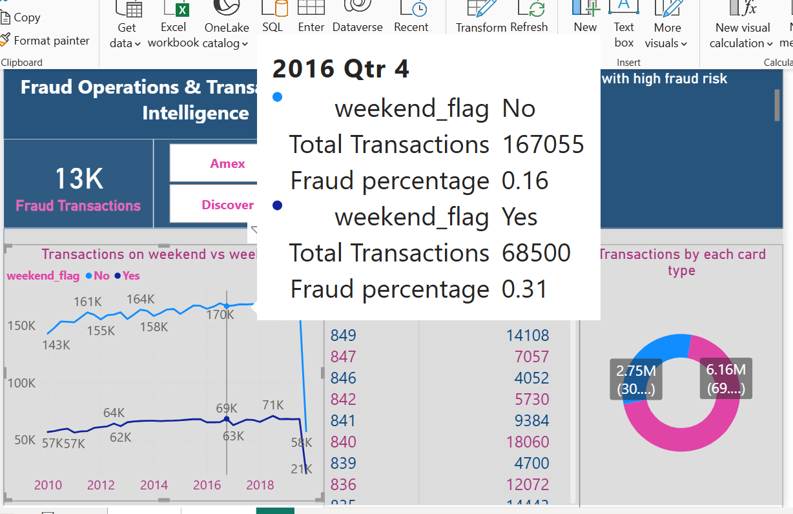

# Fraud Detection & Consumer Spend Analytics

End-to-end fraud analytics and business intelligence project built using SQL Server, Python ETL, Power BI, and LightGBM on ~ 8.9 million financial transaction records.

**Project Walkthrough:** [Demo😊](https://vimeo.com/1191142004?share=copy&fl=sv&fe=ci)
---

## Tech Stack

* Python
* SQL Server
* Power BI
* LightGBM
* Optuna
* Pandas
* DAX

DATASET: https://www.kaggle.com/datasets/computingvictor/transactions-fraud-datasets

Comprehensive financial dataset combines transaction records, customer information, and card data from a banking institution
transactions_data.csv, cards_data.csv, mcc_codes.json, train_fraud_labels.json, users_data.csv

---

## Project Overview

This project combines:

* Data Engineering
* Data Warehousing
* Business Intelligence
* Machine Learning

The system was designed to:

* Analyze consumer spending behavior
* Monitor fraud operations
* Optimize large-scale SQL querying
* Predict fraudulent transactions using ML

---

## Data Engineering & SQL

### ETL Pipeline

Built Python ETL pipelines to:

* Clean raw transaction data
* Handle missing values
* Process timestamps
* Load transformed data into SQL Server

### SQL Modeling

Created:

* Fact table
* Customer dimension
* Merchant dimension
* Date dimension
* Card dimension
* Merchant Category Code

Implemented a **Star Schema** in Power BI Model View.


                  

### SQL Optimization

Applied indexing on key columns to improve:

* Query execution speed
* Dashboard responsiveness
* Large-scale joins

---

## Power BI Dashboards

### 1. Executive Network Performance & Consumer Spend Analytics

#### KPIs

* Gross Network Revenue
* Net Revenue
* Issuer Incentives
* Total Transactions

#### Visuals

* MCC Slicer
* Total Spend by Income Group
* Transactions by Age Group

#### Business Objective

Provide executive-level insights into:
•	Consumer spending patterns
•	Revenue performance
•	Customer demographics
•	Transaction distribution

---

### 2. Fraud Operations & Transactional Risk Intelligence

#### KPIs

* Fraud Transactions

#### Visuals

* Top 10 High-Risk Merchant Categories
* Weekend vs Weekday Transactions
* Transactions by Card Type
* Credit Score vs Total Transactions

#### Business Objective

Enable fraud monitoring teams to:
•	Identify risky merchant categories
•	Analyze fraud transaction behavior
•	Understand temporal fraud trends
•	Monitor customer risk segments

---

## Machine Learning

### Model

* LightGBM Classifier

### Feature Engineering

Created behavioral fraud-risk features:

* avg_spend
* failed_transaction_count
* night_transaction_flag
* merchant_risk_flag
* account_age_days
* merchant_risk_frequency

### Hyperparameter Tuning

* Optuna

---

## Model Performance

| Metric    | Score  |
| --------- | ------ |
| AUC       | 0.9954 |
| Precision | 0.9369 |
| Recall    | 0.6333 |

---
## Project Architecture

```text
Raw Transaction Data
           ↓
Python ETL Pipeline
           ↓
SQL Server Database
           ↓
Fact & Dimension Tables
           ↓
Indexed SQL Tables   -> Views  -> ML pipeline (sampling) ->  Model Training
          ↓
Power BI Star Schema Model
          ↓
Interactive Dashboards
```

---
#### Weekend vs Weekday fraud transaction 

Fraudulent transactions tended to be higher on weekends than weekdays in most quarters, though this was not always the case.



---
## Key Learnings

* Large-scale SQL optimization
* Star schema modeling
* Power BI performance tuning
* Fraud feature engineering
* End-to-end ML pipeline development

---

## Future Improvements

* Real-time fraud detection
* API deployment
* Cloud integration
* Explainable AI dashboards
* Streaming analytics
